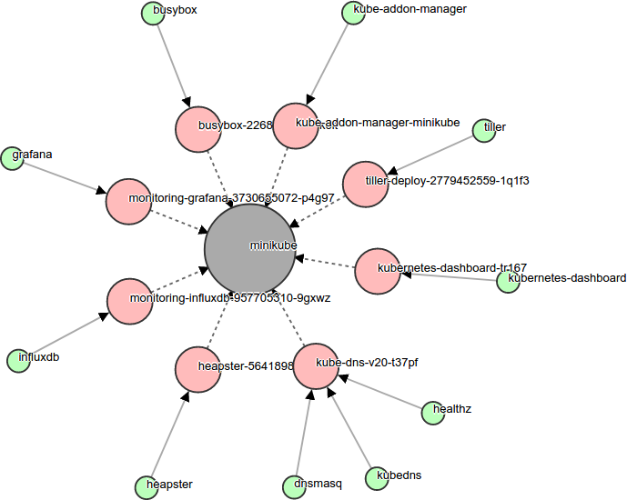

# Kvizz - A Kubernetes Visualizer
Inspired by the excellent [eriklupander/dvizz](https://github.com/eriklupander/dvizz.git), Kvizz provides an alternate way to render your Kubernetes nodes, pods and containers using the D3 [Force Layout](https://github.com/d3/d3-3.x-api-reference/blob/master/Force-Layout.md).

Legend:
- Big Gray circle: *Kubernetes Node*
- Medium size red circle: *Kubernetes Pod*
- Small green circle: *Docker Container*

Task states
- Green: *running*
- Green with red border: *preparing*
- Gray: *allocated*

